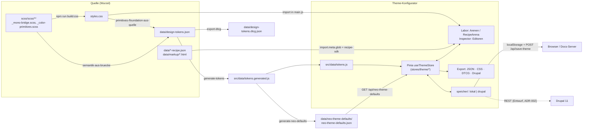

# NEO Theme-Konfigurator

Vue-App zum Anpassen des NEO-Standard-Themes an das Corporate Design eines
Kunden: Markenfarben, semantische Rollen (hell/dunkel), Foundation
(Abstände, Radien, Schatten, Typografie …), Komponenten-Tokens, Schriften,
Icons. Die Vorschau zeigt echte Komponenten des NEO Design Systems.

**Zielbild:** Die App wird Teil der Config Tools der **neo Workplace
Plattform (Drupal 11)**; gespeichert wird in der Drupal-Instanz des Kunden
als Config Entity (nur Abweichungen vom NEO-Standard, ohne Revisionen), mit
Rechten und Kontrast-Prüfung vor dem Veröffentlichen
([ADR-002](../../docs/adr/ADR-002-speichern-in-drupal.md), angenommen 01.10.2026). Heute läuft sie
lokal mit dem Docs-Server und speichert im Browser.

| | |
| --- | --- |
| App-Version | `package.json` → `1.0.0-rc.1` (Übergabe-Kandidat) |
| Stack | Vue 3.5, Pinia 3, Vite 7, Vitest 4, Playwright 1.56 |
| Node | 22 (wie CI) |
| Architektur-Entscheidungen | [ADR-001 Token-Quelle](../../docs/adr/ADR-001-eine-quelle-vier-ausgaben.md) · [ADR-002 Speichern](../../docs/adr/ADR-002-speichern-in-drupal.md) · [ADR-003 Store](../../docs/adr/ADR-003-store-pinia-setup-stores.md) · [ADR-004 Server/Auslieferung](../../docs/adr/ADR-004-server-und-auslieferung.md) |
| API-Entwurf (Drupal) | [`docs/api/theme-konfigurator.openapi.yaml`](../../docs/api/theme-konfigurator.openapi.yaml) |

Pfade ohne `apps/theme-configurator/` davor beziehen sich auf diesen Ordner;
`<wurzel>` ist das Repository (WEBSITE26).

---

## Schnellstart

```bash
# im Repository-Wurzelverzeichnis
npm ci
npm run build:css        # styles.css — Eingabe für Token-Skripte UND App (main.js importiert sie)
npm run tokens           # nur nötig, wenn Tokens/SCSS geändert wurden (Generate sind eingecheckt)

cd apps/theme-configurator && npm ci && cd ../..
npm run config:build     # baut config/theme-configurator/ + config/theme-config.html
npm run docs             # Docs-Server auf 127.0.0.1:3000
```

Dann öffnen: **http://localhost:3000/config/theme-config**
(ohne Build antwortet diese Adresse mit 503 und einer Anleitung).

### Entwicklung mit Hot Reload

```bash
npm run docs                                   # Terminal 1: API auf :3000
cd apps/theme-configurator && npm run dev      # Terminal 2: Vite
```

Öffnen: **http://localhost:5173/config/theme-configurator/** (Vite-`base`).
Vite leitet `/api` an `http://127.0.0.1:3000` weiter und darf Dateien aus
der Wurzel lesen (`styles.css`, Schriften, `data/*-recipe.json`), siehe
`vite.config.js`. Ohne Docs-Server läuft die App, aber Speichern auf den
Server und der Styleguide-Abgleich schlagen fehl; „Reset“ nutzt dann die
eingebauten Standardwerte.

### Nützliche Befehle

| Wo | Befehl | Zweck |
| --- | --- | --- |
| App | `npm test` / `npx vitest run` | Unit- und Komponententests |
| App | `npm run lint` / `npm run typecheck` | ESLint und Typprüfung (siehe „Lint und Typen“) |
| App | `npm run e2e` / `npm run e2e:visuell` | Playwright (siehe [e2e/README.md](e2e/README.md)) |
| App | `npx vite build` | Build nach `<wurzel>/config/theme-configurator/` |
| Wurzel | `npm run config:build` | Build + Prüfung des Einstiegs |
| Wurzel | `npm run config:budget` | Bundle-Budget (`bundle-budget.json`) |
| Wurzel | `npm run tokens` | Token-Pipeline (siehe unten) |
| Wurzel | `npm run tokens:semantik:check`, `tokens:werk:check`, `tokens:foundation:check`, `tokens:dtcg:check`, `lint:schwellen` | Drift-Wächter wie in CI |

---

## Architektur und Datenfluss



- **Token-Quelle** (ADR-001): `data/design-tokens.json`. Übergangsweise
  folgt sie der SCSS: Primitives und Foundation-Familien werden aus dem
  **kompilierten** `styles.css` übernommen, die Semantik aus
  `_mono-bridge.scss`. Deshalb vor `npm run tokens` immer
  `npm run build:css`. `npm run tokens` führt nacheinander aus:
  `primitives-aus-quelle` → `foundation-aus-quelle` → `semantik-aus-bruecke`
  → `generate-tokens` (→ `src/data/tokens.generated.js`, außerdem
  `data/design-tokens.css`, `_design-tokens.generated.scss`) →
  `generate-neo-defaults` → `export-dtcg`. Die Generate sind eingecheckt;
  CI bricht bei Drift ab.
- **`src/data/tokens.js`** reicht das Generat an die App weiter
  (`semanticDefaults`, `foundationTokens`, `componentTokenGroups`, …); nie
  von Hand ändern.
- **Store** hält beide Theme-Sets (`neo`, `customer`) × hell/dunkel plus
  alle Overrides; Details unten und in ADR-003.
- **Vorschau:** `main.js` lädt das gebaute `styles.css` des Design Systems
  (`--fnd-*`) und `src/style.css` (App-Chrome, `--cfg-*`). Arenen lösen
  Tokens über `composables/useTokenResolver.js` auf (Override im Store →
  Komponenten-Token → semantische Rolle → Standard).

### Verzeichnisstruktur

```text
apps/theme-configurator/
├── index.html, vite.config.js, vitest.config.js, playwright.config.js
├── build-info.js          Version/Commit/Build-Datum als Vite-define
├── bundle-budget.json     Obergrenzen für das Bundle (CI)
├── src/
│   ├── main.js, App.vue   Einstieg: Pinia, Header, Sidebar, Labor, Inspector
│   ├── stores/            theme.js (Fassade) + theme/*.js, branches.js,
│   │                      styleguide-sync.js, plugins/verlauf.js, pinia.js
│   ├── navigation/        hash-router.js, sektionen.js (Registry), sektions-ids.js
│   ├── components/        layout/ (Header, Sidebar, Inspector), laboratory/ (Arenen),
│   │                      foundation/, components/, editors/, workflow/ (Dialoge),
│   │                      templates/, ui/
│   ├── lib/               recipe-arena.js (Recipe → Zellen), app-version.js
│   ├── arena-templates/   Markup-Vorlagen je Recipe-ID (<id>.js)
│   ├── composables/       Token-Auflösung, Recipe-Loader, Arena-Resolver, Fokusfalle …
│   ├── speicher/          index.js (Auswahl), lokal.js, drupal.js, kontrast.js, fehler.js
│   ├── export/            dtcg.js, drupal-adapter.js, foundation-css.js, type-scale-css.js
│   ├── import/            theme-import.js (Prüfung + Vorschau)
│   ├── data/              tokens.generated.js (Generat), tokens.js, navigation-builder.js
│   └── utils/
├── tests/                 Vitest (a11y, arena, components, composables, export,
│                          import, navigation, speicher, stores, utils)
└── e2e/                   Playwright, axe-Basislinie, Screenshot-Baselines
```

Außerhalb der App: `<wurzel>/packages/recipe-sdk` und
`<wurzel>/packages/dtcg-export` (Vite-Aliase `recipe-sdk`, `dtcg-export`),
`<wurzel>/scripts/docs-server.js`, `<wurzel>/config/theme-config.vorlage.html`.

---

## Store und Verlauf

Entscheidung und Alternativen: [ADR-003](../../docs/adr/ADR-003-store-pinia-setup-stores.md).

- `useThemeStore()` (`stores/theme.js`) ist die einzige Schnittstelle für
  Komponenten: `state`, abgeleitete Werte (`currentSemanticTokens`,
  `isDirty`, …) und Aktionen. Umgesetzt sind sie in `stores/theme/*.js`
  (kern, getter, ui, token-aktionen, komponenten, verlauf, themes,
  persistenz, export, theme-sets, praesentation).
- **Theme-Inhalte** = `THEME_DATA_KEYS` (`stores/theme/verlauf.js`). Neues
  Feld → dort eintragen; `tests/stores/theme-schema.test.js` prüft das.
- **Undo/Redo:** Aktionen in `VERLAUF_AKTIONEN` legen über das Pinia-Plugin
  `stores/plugins/verlauf.js` automatisch einen Schritt an (nur bei echter
  Änderung; Folgen < 400 ms werden zusammengefasst; max. 50 Schritte).
  Neue ändernde Aktion → Namen in `VERLAUF_AKTIONEN` aufnehmen.
  Tastatur: Strg/Cmd+Z, Strg/Cmd+Shift+Z (außer in Textfeldern).
- **Auto-Save:** `stores/theme/persistenz.js` schreibt den Arbeitsstand bei
  jeder Änderung nach `localStorage`.
- Weitere Stores: `useBranchStore` (lokale Branches/Releases, Merge) und
  `useStyleguideSync` (Zusatzpaletten in den Styleguide, nur mit Docs-Server).
- Pinia-Instanz immer über `erzeugePinia()` (`stores/pinia.js`) – so haben
  App und Tests dasselbe Plugin.

---

## Navigation und Deep-Links

Die Sidebar entsteht aus `data/component-registry.json`
(`src/data/navigation-builder.js`; neu erzeugen mit `npm run registry` in der
Wurzel). `src/navigation/sektionen.js` ordnet jeder Sektion Labor-Ansicht
und Inspector zu: Foundation-Sektionen fest, `component-*`, `template-*`,
`module-*`, `utility-*` nach Präfix.

**URL-Schema** (`src/navigation/hash-router.js`): Sektions-ID am ersten `-`
geteilt.

| Sektion | Hash |
| --- | --- |
| `foundation-colors` (Start) | `#/foundation/colors` |
| `component-button` | `#/component/button` |
| `component-code-snippet` | `#/component/code-snippet` |
| Button, Customer-Set, dunkel | `#/component/button?set=customer&modus=dark` |

- `set` (`neo` | `customer`) und `modus` (`light` | `dark` | `split` |
  `matrix`) stehen nur in der URL, wenn sie vom Standard (`neo`, `light`)
  abweichen.
- Sektionswechsel legen einen Browser-Verlaufseintrag an (Zurück/Vor
  funktioniert), Set-/Modus-Wechsel ersetzen ihn.
- Beim Start gewinnt ein gültiger Hash vor dem gespeicherten Stand;
  unbekannte Sektionen führen zur Startsektion.
- Beispiel: `http://localhost:3000/config/theme-config#/component/badge?modus=dark`

---

## Arenen aus Recipes

Im Regelfall zeigt eine Komponente die **RecipeArena**
(`components/laboratory/RecipeArena.vue`): Sie baut die Vorschau aus
demselben Recipe, aus dem auch Drupal und Storybook die Komponente erzeugen.
Ablauf (`src/lib/recipe-arena.js`): Recipe normalisieren → Specimen-Matrix
(Achsen × Zustände, `recipe-sdk`) → Modell (Klassen, Attribute, Slots) →
Zelle aus der Vorlage `src/arena-templates/<id>.js` oder, ohne Vorlage, per
Slot-Heuristik. 46 Komponenten haben noch eine handgeschriebene Arena
(`SONDERFAELLE` in `composables/useArenaResolver.js`); sie hat Vorrang.

**Neue Vorlage anlegen**

1. Recipe `<wurzel>/data/<id>-recipe.json` (Schema:
   `<wurzel>/docs/recipes/schema.md`, `data/recipe-schema.json`; prüfen mit
   `npm run lint:recipes`). Die App findet es per `import.meta.glob`
   automatisch (`composables/useRecipeLoader.js`).
2. Echtes Markup in `<wurzel>/data/markup/<id>.html` ablegen (siehe
   `data/markup/LIESMICH.md`) – Quelle der Vorlage.
3. `src/arena-templates/<id>.js` anlegen:
   `export default (zelle, m) => \`<… class="${m.klasse}"${m.attrs}>…\``.
   `m` liefert `klasse`, `attrs`, `slot(name)`, `text`, `hat(zustand)`,
   `deaktiviert`, `wert(achse)`, `uid` (Beschreibung im Kopf von
   `arena-templates/index.js`). Registrierung ist automatisch; Dateien mit
   `_` sind Helfer.
4. In der Navigation erscheint die Komponente über
   `npm run registry` (Wurzel).
5. `npx vitest run tests/arena` – `vorlagen.test.js` verlangt, dass jede
   Zelle aus der Vorlage kommt und jede Vorlage zu einem Recipe gehört.
   Snapshots nur bei gewollter Änderung aktualisieren (`-u`).
6. Steht die ID in `SONDERFAELLE`, ist die Vorlage erst sichtbar, wenn der
   Eintrag dort entfernt wird. Danach `meta.pipeline.arena` im Recipe (und
   in `specs/<id>.spec.json`) auf `RecipeArena.vue` setzen und die alte
   `<Name>Arena.vue` löschen – `tests/arena/recipe-pipeline.test.js` prüft,
   dass der Pfad existiert.

---

## Speichern

Entscheidungen und Folgen: [ADR-002](../../docs/adr/ADR-002-speichern-in-drupal.md).
Code: `src/speicher/` (gemeinsame Schnittstelle, JSDoc in `index.js`).

| Adapter | Standard | Verhalten |
| --- | --- | --- |
| `lokal` | ja | Arbeitsstand, benannte Themes, Katalog im `localStorage`; „Speichern“ (Strg/Cmd+S) → `POST /api/save-theme` am Docs-Server; NEO-Standard über `GET /api/neo-theme-defaults` |
| `drupal` | nein | REST nach `docs/api/theme-konfigurator.openapi.yaml` (Vertrag 1.0.0): Sitzungs-Cookie + `X-CSRF-Token`, ETag = Inhalts-Hash/`If-Match` (412 veraltet, 428 fehlt, 409 Zustand), nur Abweichungen vom NEO-Standard (`speicher/abweichungen.js`), Aktivieren (genau eines aktiv), Veröffentlichen mit CSS und Kontrast-Tor (`speicher/kontrast.js`, Paarliste `data/kontrast-paare.json`) |

**Konfiguration** (`leseKonfiguration()` in `speicher/index.js`; `window`
gewinnt vor env):

```html
<script>
  window.NEO_KONFIGURATOR = {
    speicher: 'drupal',                          // 'lokal' | 'drupal'
    basisUrl: '/api/neo-theme-konfigurator/v1',
    csrfToken: '…',                              // oder csrfTokenUrl (Standard '/session/token')
    rechte: ['ansehen', 'bearbeiten']            // aus drupalSettings; lokal: alle
  }
</script>
```

Für die Entwicklung alternativ `VITE_NEO_SPEICHER`, `VITE_NEO_BASIS_URL`,
`VITE_NEO_CSRF_TOKEN_URL`, `VITE_NEO_RECHTE` (kommagetrennt; z. B. in
`.env.local`). Rechte abfragen: `darf('veroeffentlichen')` aus `speicher/index.js`.

localStorage-Schlüssel (lokal): `neo-theme-configurator` (Arbeitsstand),
`neo-theme-configurator-saved-themes` (Katalog), `neo-theme-<id>`
(benannte Themes), `neo-theme-branches`, `neo-theme-releases`. Im
Drupal-Betrieb zusätzlich `neo-theme-configurator-drupal-stand`
(Fingerabdruck des zuletzt gespeicherten Stands für die Statusanzeige).

### Oberfläche im Drupal-Betrieb

Lokal bleibt die Oberfläche unverändert. Mit `speicher: 'drupal'` ersetzt
`components/drupal/DrupalWerkzeuge.vue` im Header Neu/Theme-Auswahl/
Branches/Speichern/Löschen/Merge; Zustand und Abläufe in
`composables/useDrupalBetrieb.js`.

| Was | Verhalten |
| --- | --- |
| Theme-Auswahl | Themes der Instanz mit „aktiv“ und Status (Entwurf / Veröffentlicht / Geändert), Öffnen (fragt bei ungespeicherten Änderungen), **Neu anlegen** vom NEO-Standard (Set „Customer“), **Aktivieren** (nur veröffentlichte, Recht „veröffentlichen“), **Löschen** mit Bestätigung (das aktive nicht) |
| Speichern | Knopf und Strg/Cmd+S → `PUT` mit `If-Match`; Status „Gespeichert“ / „Ungespeicherte Änderungen“ / Fehler. Ohne Drupal-Theme: Dialog „Als neues Theme speichern“ |
| Konflikt (412) | Dialog „Das Theme wurde inzwischen geändert“: **Neu laden** (eigene Änderungen verwerfen) oder **Abbrechen** (weiterarbeiten, nichts gespeichert) |
| Veröffentlichen | Dialog mit der Kontrastprüfung der App (bestanden oder Befundliste mit Paaren und Werten); nur bei bestanden und gespeichertem Stand. Server-422 zeigt die Befunde des Servers; Erfolg erklärt die Auslieferung über die Theme-Library und bietet „Jetzt aktivieren“ |
| Rechte | ohne „bearbeiten“: Banner „Nur Ansicht“, Editoren im Inspector gesperrt (`<fieldset disabled>`), ändernde Store-Aktionen angehalten (`stores/plugins/schreibschutz.js`); ohne „veröffentlichen“: Veröffentlichen/Aktivieren gesperrt |
| Fehler | Netzwerk, 403 (Recht, CSRF), 413 u. a. als Hinweis-Dialog (`meldungFuer()` in `speicher/fehler.js`) |
| Ausgeblendet | Branches/Releases (Beschluss E), Styleguide-Merge (braucht den lokalen Docs-Server) |

### Drupal-Betrieb lokal ausprobieren

`scripts/drupal-attrappe.mjs` bildet den Vertrag 1.0.0 im Speicher nach (nur
Node-Builtins) — zum Ausprobieren, für die E2E-Tests und als lauffähige
Referenz für die Drupal-Entwicklung. ETag, Zusammenführen und Kontrastprüfung
rechnet sie mit denselben Modulen wie die App (`inhalts-hash.js`,
`abweichungen.js`, `kontrast.js` + `data/kontrast-paare.json`).

```bash
npm run config:build                 # Wurzel: App bauen (einmal)
npm run drupal:attrappe              # http://127.0.0.1:3200/
# mit Optionen:
node scripts/drupal-attrappe.mjs --port 3200 --rechte ansehen,bearbeiten \
     --datei /tmp/neo-themes.json --csrf-token geheim
```

- `/` zeigt Links zum Konfigurator mit allen Rechten, ohne „veröffentlichen“
  und „nur ansehen“; `/konfigurator?rechte=ansehen,bearbeiten` startet die App
  mit `window.NEO_KONFIGURATOR = { speicher: 'drupal', basisUrl, csrfToken, rechte }`
  und merkt die Rechte als Cookie (wie eine Drupal-Sitzung).
- Rechte für einzelne Anfragen: Kopfzeile `X-Neo-Rechte: ansehen,bearbeiten`
  (Vorrang vor Cookie und `--rechte`). CSRF-Token: `GET /session/token`.
- Prüft wie der Vertrag: `If-Match` (428/412 mit `aktuellerEtag`), 409
  (aktives löschen, Entwurf aktivieren), 422 (Schema `ThemeAbweichungen`,
  Kontrast-Tor auf dem gespeicherten Stand), 413 (> 1 MB), 403 (Recht, CSRF).
- Ohne `--datei` beginnt jeder Start leer. Nicht nachgebildet: Anmeldung,
  Ablage der CSS-Datei im Dateisystem, Cache-Leerung.

**Prüffälle für PHP:** `data/pruefvektoren/speicher-vertrag.json` enthält
Hash-, ETag-, Abweichungs-, Zusammenführungs-, Kontrast- und Schema-Fälle mit
dem erwarteten Ergebnis der App. Das Drupal-Modul spielt sie in seinen Tests
ab. Neu erzeugen mit `npm run drupal:pruefvektoren` (Wurzel), Drift-Prüfung mit
`npm run drupal:pruefvektoren:check` (läuft in CI).

---

## Export und Import

Alle Exporte beziehen sich auf das **aktive** Theme-Set (Header, Menü „Export“; dort auch Import und DTCG).

| Format | Datei | Inhalt |
| --- | --- | --- |
| Theme-JSON | `<name>.theme.json` | `exportAsJSON()`: `meta` (name, version, branch, generated, generator), `components`, `primitives`, `semantic.light/dark`, `foundation`, `typeScale`, `focusRingMode`. Ohne eigene Tokens, Schriften, Icons. |
| CSS-Variablen | `<name>.theme.css` | `exportAsCSSVars()` |
| DTCG (W3C Design Tokens) | `<name>.tokens.dtcg.json` | Dialog mit Hinweisliste; derselbe Exporter wie `scripts/export-dtcg.cjs` (`packages/dtcg-export`). Unverändertes NEO-Theme = byte-gleich mit `data/design-tokens.dtcg.json`; nicht Abbildbares steht in `$extensions["de.neocosmo"].themeExport.nichtAbgebildet`. |
| Drupal | `<name>-override.css`, `<name>-settings.json` | `export/drupal-adapter.js` |

**Import** (`src/import/theme-import.js`, Dialog im Header): nur das
Theme-JSON-Format. Die Datei wird vollständig geprüft (bekannte Schlüssel,
Typen, Farbwerte, bis 25 Fundstellen auf einmal) und abgelehnt, wenn ein
Fehler vorliegt; sonst Vorschau je Bereich, dann Übernahme als ein
Undo-Schritt. Eigene Tokens, Schriften und Icons bleiben unverändert.

---

## API

### Heute: Docs-Server (`scripts/docs-server.js`)

Nur lokal (`127.0.0.1:3000`, `HOST`/`PORT` änderbar), Host- und
Origin-Prüfung, max. 2 MB je Anfrage. Details: ADR-004.

| Methode, Pfad | Antwort / Wirkung |
| --- | --- |
| `GET /api/neo-theme-defaults` | `{ status: 'ok', defaults }` aus `data/neo-theme-defaults/neo-theme-defaults.json` |
| `POST /api/save-theme` | Pflicht `primitives`, `theme`; optional `semantic`, `components`, `foundation`, `typeScale`, `meta`. Schreibt `website/data/custom-theme.json` und `data/theme-overrides.css`, ggf. `ddev drush cr`. → `{ status, path, cssPath }`, bei Fehler 400 |
| `GET /api/styleguide-status` | `{ status, palettes: [{ id, base }] }` |
| `POST /api/preview-styleguide-update` | Trockenlauf für `{ palettes: [{ id, label, base }] }` → Diffs |
| `POST /api/update-styleguide` | schreibt neue Paletten in SCSS und Farb-Doku |
| `GET /*` | statische Dateien aus der Wurzel; `/` → `/docs/` |

### Drupal-REST (Vertrag 1.0.0, 01.10.2026)

[`docs/api/theme-konfigurator.openapi.yaml`](../../docs/api/theme-konfigurator.openapi.yaml)
(OpenAPI 3.1, Basis `/api/neo-theme-konfigurator/v1`, eine Instanz je Kunde):
`GET /neo-standard`; `GET|POST /themes` (Liste mit `aktiv`);
`GET|PUT|DELETE /themes/{themeId}` (If-Match Pflicht); `POST …/aktivieren`;
`POST …/veroeffentlichen` (Kontrast + CSS); `GET …/export?format=css|abweichungen`.
Rechte je Operation in `x-neo-recht`, Größenlimit 1 MB (`x-neo-max-bytes`, 413).
Gegenstück in der App: `src/speicher/drupal.js`. `tests/speicher/openapi.test.js`
prüft, dass jede URL des Adapters in der OpenAPI-Datei steht und
`ThemeAbweichungen` zu `THEME_DATA_KEYS` passt.

**Vor dem Ausrollen eines neuen NEO-Standards:** Abweichungen aller Themes
exportieren und `node scripts/pruefe-kunden-themes.mjs --standard <neu.json> <ordner>`
laufen lassen (Exit ≠ 0 = Kontrast-Befund).

---

## Lint und Typen

**ESLint** (`eslint.config.js`, ESLint 9 flat config, `eslint-plugin-vue`
„recommended“): `npm run lint` prüft `src/`, `tests/`, `e2e/` und die
Konfigurationsdateien und muss **0 Fehler** melden. Fehler-Regeln sind die
inhaltlichen (`no-undef`, `no-unused-vars`, `no-dupe-keys`,
`vue/no-mutating-props` …). Die reinen Layout-Regeln von eslint-plugin-vue
(Attribute je Zeile, Einrückung, Self-Closing …) sind aus, weil der Code
einen eigenen, konsistenten Stil hat; `vue/no-v-html` und
`vue/no-template-shadow` bleiben als Warnung sichtbar. Ungenutzte Parameter
sind erlaubt (Render-Helfer mit fester Signatur), ungenutzte Variablen und
Importe nicht; bewusst Ungenutztes beginnt mit `_`.

**Prettier** ist bewusst nicht eingebunden: Schon „nur geänderte Dateien“
würde jede berührte Datei komplett umformatieren (Arenen mit langen
Render-Zeilen, ausgerichtete Token-Tabellen wie `MIRROR_TOKEN_MAP`) und
Diffs unlesbar machen. Formatierung bleibt Review-Sache.

**Typprüfung** ohne Umstellung auf TypeScript: `npm run typecheck`
(`tsc -p jsconfig.json`, TypeScript 5.9). Geprüft werden nur Dateien mit
`// @ts-check` in der ersten Zeile – heute alle Dateien unter
`src/stores/**`, `src/speicher/**`, `src/export/**` und `src/lib/**`.
Typen kommen aus JSDoc (`@param`, `@typedef`, z. B. `Speicher` in
`speicher/index.js`) und aus:

- `src/data/tokens.generated.d.ts` – erzeugt von
  `scripts/generate-tokens.cjs` (`npm run tokens`) neben
  `tokens.generated.js`: die Struktur jedes Exports, aus den Daten
  abgeleitet, plus `ThemeKey`, `SemanticTokenId`, `ComponentGroupId`.
  Nicht von Hand ändern; die CI prüft, dass sie aktuell ist.
- `src/env.d.ts` – Vite-`define` (`__APP_VERSION__` …) und
  `import.meta.env.VITE_NEO_*`.
- `src/pinia-optionen.d.ts` – Store-Optionen `verlauf` und `schreibschutz`
  der eigenen Pinia-Plugins.

Der Modus ist bewusst locker (`strict: false`). Weitere Dateien kommen
dazu, indem man `// @ts-check` ergänzt und die Meldungen behebt.

**Pre-Commit-Hook** (`.githooks/pre-commit`): ESLint läuft nur auf den
gestagten `.js`/`.vue`-Dateien der App (wie die Tests per `vitest
related`). **CI** (Job *App*): `npm run lint` und `npm run typecheck` vor
den Tests.

---

## Tests, CI, Release

| Ebene | Wo | Befehl |
| --- | --- | --- |
| Unit/Komponenten | `tests/` (Vitest, happy-dom; 33 Dateien, 780 Tests am 30.09.2026) | `npx vitest run` |
| E2E | `e2e/` (Playwright gegen das **gebaute** Bundle, Docs-Server auf Port 3100; Projekt `drupal` gegen die Drupal-Attrappe auf Port 3101) | `npm run e2e` |
| Barrierefreiheit | `e2e/axe.spec.js` mit Basislinie `e2e/axe-basislinie.json` (darf nur sinken); `tests/a11y/` | s. [e2e/README.md](e2e/README.md) |
| Visuell | `e2e/arenen.visuell.spec.js`, Linux-Baselines, kein Gate | `npm run e2e:visuell` |

**CI** (`.github/workflows/theme-configurator.yml`, bei Änderungen an App,
Paketen, Daten, SCSS, Skripten, Doku, Config): Token-Drift → Lint → Typen →
Vitest → Build → Einstieg → Bundle-Budget → Artefakt
`theme-configurator-<sha>` (30 Tage) → E2E. Screenshot-Vergleich nur per *Run workflow*.

**Release** (`.github/workflows/release-konfigurator.yml`):

1. `version` in `apps/theme-configurator/package.json` setzen (SemVer; bis
   zur abgestimmten Drupal-Schnittstelle `1.0.0-rc.N`), committen.
2. `git tag konfigurator-v<version> && git push origin konfigurator-v<version>`
3. Der Workflow prüft Tag = `package.json`, testet, baut und legt ein
   GitHub-Release mit `theme-configurator-<version>.zip`
   (`theme-config.html` + `theme-configurator/`) an.

**Versionsanzeige:** Der Header zeigt „Theme v…“ (Version des bearbeiteten
Themes, `state.version`, Theme-Metadaten) und daneben „App <version> ·
<commit>“ (Build, aus `build-info.js`); das Build-Datum steht im Tooltip.

---

## Integration in Drupal

Vorschlag (ADR-004), abhängig von den offenen Fragen in ADR-002:

1. Release-ZIP in ein Drupal-Modul der Config Tools übernehmen und JS/CSS
   aus `theme-configurator/assets/` als Library registrieren.
2. Admin-Route mit `<div id="app"></div>`; vor dem App-Skript
   `window.NEO_KONFIGURATOR` setzen (aus `drupalSettings`: `speicher:
   'drupal'`, `basisUrl`, `csrfToken`, `rechte`).
3. REST-Endpunkte nach der OpenAPI-Datei umsetzen (ADR-002: Config Entity
   ohne Revisionen, schlanker REST-Controller, Abweichungen vom Standard,
   If-Match/Inhalts-Hash, Kontrast-Tor serverseitig mit 422).
4. Veröffentlichtes CSS über einen Override in der Theme-Library ausliefern.

Offene Umsetzungsanforderungen (ADR-002): `config_ignore` für die
Theme-Konfiguration, Library-Override mit Ablagepfad und Cache-Leerung,
Schema-/Größenprüfung und Kontrastprüfung in PHP, Permissions.

---

## Bekannte Grenzen

- **Speichern in Drupal:** Vertrag, App-Seite und Oberfläche stehen (ADR-002,
  01.10.2026); der Drupal-Server ist noch nicht gebaut — lokal übernimmt die
  Drupal-Attrappe. Ohne Konfiguration speichert die App nur im Browser bzw.
  über den lokalen Docs-Server.
- **Vite-`base` fest** auf `/config/theme-configurator/`; ein anderer Pfad in
  Drupal braucht einen angepassten Build.
- **Externe Schriften:** Der Einstieg (`config/theme-config.vorlage.html`) lädt
  Google Fonts; Datenschutz/CSP klären.
- **Nur mit Docs-Server:** Styleguide-Abgleich, Drupal-Cache-Clear (auf
  `/opt/homebrew/bin/ddev` und `../DRUPAL11` verdrahtet).
- **Branches/Releases** der App sind lokal; im Drupal-Betrieb werden sie
  ausgeblendet (Beschluss E, `faehigkeiten.branchesUndReleases`).
- **Ein Konfigurator je Seite:** Der Store-Zustand liegt auf Modul-Ebene
  (ADR-003).
- **Export ist nicht verlustfrei:** Theme-JSON ohne eigene Tokens, Schriften,
  Icons; DTCG listet nicht Abbildbares; es gibt keinen DTCG-Import.
- **Handgeschriebene Arenen:** 46 Komponenten laufen noch nicht über die
  RecipeArena.
